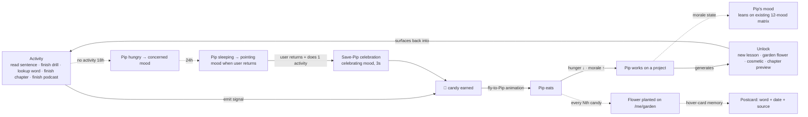
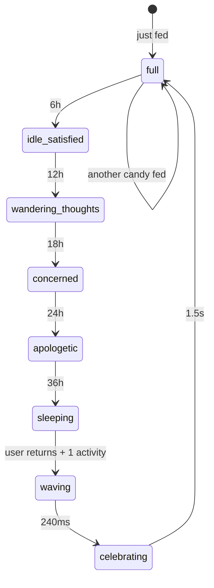
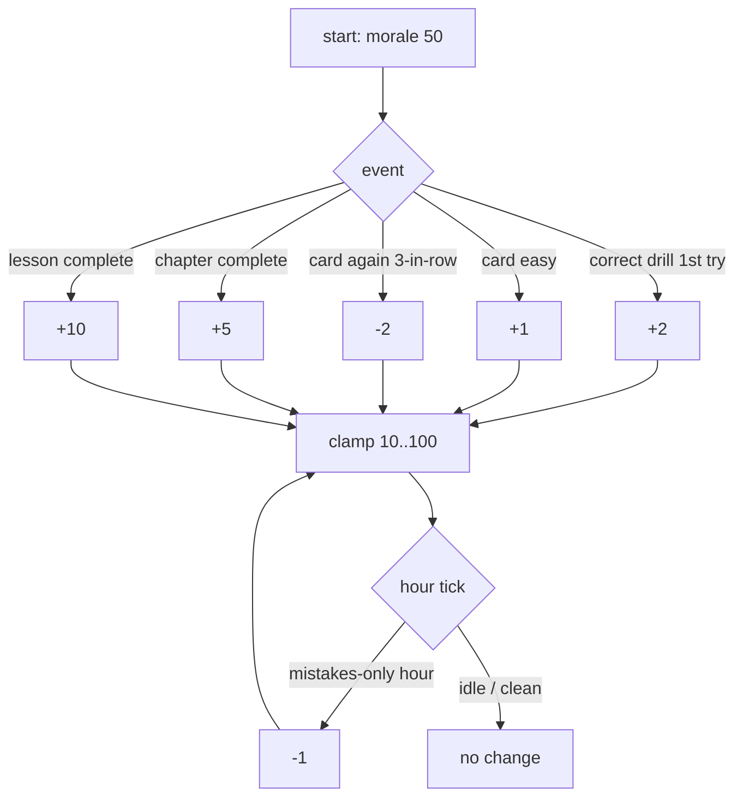
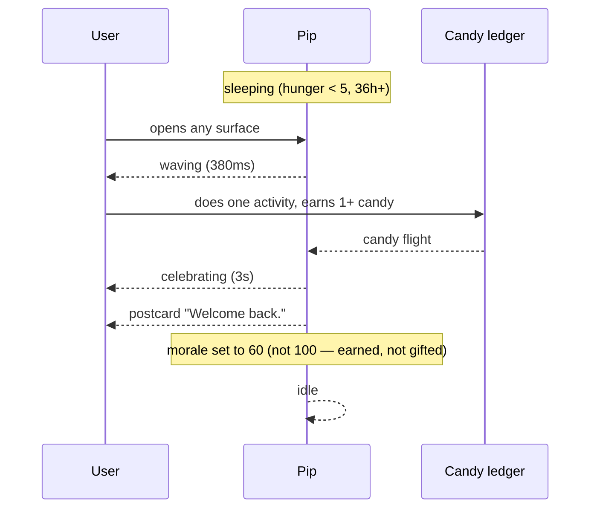

# Design request: Gamification — Pikmin-Bloom-inspired ecosystem (Pip as tamagotchi-learner)

**Status:** open
**Filed:** 2026-05-21
**Author:** orchestrator (gamification brainstorm — user-initiated)
**Context refs:**
- `requests/11-pip-mood-matrix-and-avatar-companion.md` — Pip's 12-mood matrix (already covers `celebrating`, `apologetic`, `concerned`, `proud`, `encouraging`, `thinking`, `listening`, `waving` — half the state machine in this request rides on those existing moods)
- `requests/13-visual-polish-pass.md` — illustration system (`learn-stations/public/dict-svg/` 9 138 SVGs + 10 mascot poses, single-colour stroke style). Candies + flowers in this request inherit that style.
- `v2/01-signal-and-level-model.md` — the event taxonomy (`drill.attempt`, `dict.save`, `card.rated`, `read.paragraph_dwell_ms`, `deck.complete`, etc.). This is the natural ledger for candy earning — no new signal pipeline needed.
- `v2/06-revised-unified-brief.md` §1 — the three apps + six shared services. Gamification is a **seventh shared service** (logically `garden.reeloo.ai` though it can live inside `signals` as an aggregation view).
- Source: `/home/claw/work/reeloo-v2/components/Pip.tsx:1-538` (the 12-mood primitive — has `breathe`/`blink` per-mood metadata already; hunger/morale animate naturally onto those).

---

## 1. Trigger (user framing, verbatim)

> Pikmin Bloom by Niantic encourages people to walk: walk → planting mode → plant flowers → collect nutritions → feed Pikmins → Pikmins generate flower seeds → plant more flowers. It creates a gamification ecosystem that loops users back into "walking".
>
> Borrow this. Replace "walk" with **activities in the app**: read a sentence in podcast or book, complete a drill, look up a word → earn "candies". Feed candies to the avatar (Pip). Pip works on something for the user (e.g. generates new lessons, new content, unlocks). User feels real-time dopamine — achievement unlocked, urge to earn more. If user is too slow, avatar starves / suffers → user feels empathy → comes back to save them. Multiple correct answers raises morale → bigger appetite, more output. Levels: earn X candies to promote.
>
> Brainstorm the flowers → nutrition → seeds ecosystem cycle.

This is a tamagotchi-for-an-adult-learner. **Not** a casino. **Not** an engagement-farming loop. The success bar is: did Pip's hunger get the user to do **one drill they wouldn't have done otherwise** — not seventy.

---

## 2. What Pikmin Bloom does well (and the restraint we copy)

Five things the Niantic team got right, that this request inherits:

1. **The verb IS the gameplay.** Walking is the only way to earn seedlings. There is no "tap-to-earn" alternative. We mirror this: the only way to earn candy is to *do learning activities*. No daily-login bonus. No spin-the-wheel. Reading a sentence is the wheel.
2. **No IAP on the core loop.** Pikmin Bloom sells decoration tickets cosmetically; the walking loop itself is unmonetised. We mirror this: candies, flowers, garden — all earned, never purchased.
3. **The avatar is the persistence anchor.** Pikmin live across sessions, accumulate, look at the user, react. The accumulated army is the dopamine — not any single mission. Pip already has the 12-mood primitive; we extend it with hunger + morale state that **persists across sessions** (LocalStorage + `signals.reeloo.ai` mirror).
4. **Time-of-day matters but isn't a punishment.** Pikmin sleep at night, the app's main loop pauses. The user's offline time **isn't a penalty timer**. Critical: we copy this. Pip "rests" overnight in the user's home timezone. Hunger does *not* tick during their declared sleep hours.
5. **Postcard memories.** Big Flower Events generate keepsake postcards the user can scroll back through. We borrow this for `/me/garden` — every milestone flower has a hover-card saying "you learned `wartete` here, 2026-05-21, podcast Easy German #220".

Restraint we explicitly do NOT copy:
- Pikmin Bloom's "save these dying Pikmin or they detach" can feel manipulative if the cost of failure is too high. **Pip never permanently dies, leaves, or "abandons" the user.** Worst case Pip falls asleep in a `sleeping` pose with a small `zzz`. No guilt, no permadeath, no "you missed me".
- Pikmin Bloom's social leaderboards are absent here. **No social comparison.** This is one user, one Pip.
- Big Flower events that pressure you to walk *right now*. **No event-window urgency.** No "limited time" candies. No FOMO.

---

## 3. The Reeloo ecosystem map

The cycle the user asked for, designed end-to-end:



ASCII fallback (for terminal readers):

```
  ┌──────────── activity ─────────────┐
  │ read · drill · lookup · finish ch │
  └─────────────┬─────────────────────┘
                │  (signal event)
                ▼
            🍬 candy (1–10 per signal)
                │
                ▼  (fly-to-Pip animation, 480 ms)
         ┌──────────────┐
         │  Pip eats     │  ── morale ↑, hunger ↓
         └──────┬────────┘
                │
                ▼
         Pip works ──► unlock (lesson / flower / cosmetic)
                │           │
                │           ▼
                │       /me/garden grows
                │
       (every Nth candy → flower planted on garden, persistent)
                │
       [if no activity 18h+]
                ▼
         Pip concerned ─► Pip sleeping ─► return-and-save moment
```

Eight states, six edges. Every node is implementable as an existing UI surface or one new route (`/me/garden`).

---

## 4. System specs

### 4.1 Candy earn rates (per activity, ledger = `signals.reeloo.ai` events)

The signal model already emits these events. Candy is a derived view, not a new event class.

| Activity | Signal event | Candies | Cap / window |
|---|---|---|---|
| Read a sentence (book Page or Deck reader, dwell > 1 s) | `read.paragraph_dwell_ms` | **0.5** (rounded up to 1 every 2nd paragraph) | 80/day from book |
| Lookup a word (any surface) | `dict.save` or `dict.open` | **1** (open) + **2** (save) | 40/day from lookups |
| Drill attempt correct (first try) | `drill.attempt` with `pass=true && attempt=1` | **2** | uncapped (see §4.5) |
| Drill attempt correct (after retry) | `drill.attempt` with `pass=true && attempt>1` | **1** | uncapped |
| Flashcard graded `good` or `easy` | `card.rated` | **1** (good) / **2** (easy) | 60/day from cards |
| Finish a podcast episode | `podcast.complete` | **10** | n/a (rare event) |
| Finish a book chapter | `read.chapter_complete` | **15** | n/a (rare event) |
| Finish a lesson (all stations green) | `lesson.complete` | **20** | n/a (rare event) |
| Finish a tutorial (learn-anything) | `tutorial.complete` | **25** | n/a (rare event) |
| First-time-today bonus (any activity, once per UTC day in user timezone) | derived | **+5** | once / day |

Hard daily ceiling: **150 candies/day from active practice + 50 from passive reading = 200/day max.** A focused 25-minute session reliably earns 40–60. The cap exists so a marathon doesn't make tomorrow feel meaningless. Above the cap, signals still fire, candies still show in the UI ("you're full!"), but the daily ledger entry is capped — no infinite grind, no morale-min/max gaming.

### 4.2 Pip hunger state machine

Hunger is a 0–100 scalar. **100 = just ate.** **0 = sleeping (not dead).**

```
hours since last candy │ hunger %  │ Pip mood            │ visual cue
───────────────────────┼───────────┼─────────────────────┼─────────────────
0–6 h                  │ 80–100    │ idle (proud accent) │ small 🍬 next to Pip; eyes shine
6–12 h                 │ 50–80     │ idle                │ no cue
12–18 h                │ 30–50     │ thinking            │ Pip looks toward the user
18–24 h                │ 10–30     │ concerned           │ Pip stands at the edge of bay
24–36 h                │ 5–10      │ apologetic          │ Pip slumped; subtle grayscale
36 h+                  │ 0–5       │ sleeping (new pose) │ Pip curled, zzz, no animation
```

**Hunger does NOT tick during the user's declared sleep hours** (default 23:00–07:00 local; configurable in `/me/settings`). This is the anti-manipulation rule — we do not punish the user for sleeping.

**Save-Pip moment** (the empathy beat the user explicitly asked for):
- When `hunger < 30` and user returns and does **one activity**, the next candy triggers a 3 s `celebrating` mood with the postcard text "Thanks for coming back!" — exactly once per hunger-cycle (won't repeat on every candy).
- No shame language ("you abandoned me", "I was starving"). Pip is happy to see them. That's it.

### 4.3 Pip morale state machine

Morale is a 0–100 scalar, **separate** from hunger. Morale ↑ on correct answers, ↓ slowly on streaks of `again`/`hard` grades.

```
morale %  │ Pip mood when active  │ effect on candy→unlock conversion
──────────┼───────────────────────┼─────────────────────────────────
0–25      │ thinking / concerned  │ 1× (baseline)
25–50     │ idle                  │ 1× baseline
50–75     │ encouraging           │ 1.2× (Pip does a bit more per candy)
75–90     │ proud                 │ 1.4×
90–100    │ celebrating intermittently │ 1.5× (capped — no infinite scaling)
```

Morale decay: −1 per hour of activity-with-mistakes-only, −0 per hour idle (idle is not "negative"). Morale floor: never below 10 — Pip is **never depressed by the user's bad day**.

Morale ↑ rules:
- `drill.attempt` first-try correct: +2 morale
- `card.rated easy`: +1 morale
- `card.rated again` 3× in a row: −2 morale (only after 3 in a row, not every miss)
- `read.chapter_complete`: +5 morale
- `lesson.complete`: +10 morale

### 4.4 Level curve

Levels are Pip's level, not the user's. (The user's CEFR is the v2 signal model — separate axis. Conflating these is an anti-pattern.)

```
Level  │ Cumulative candies needed  │ What unlocks
───────┼────────────────────────────┼────────────────────────────────────
 1     │ 0                          │ start
 2     │ 50                         │ first garden flower slot enabled
 3     │ 150                        │ Pip's "working on" surface shows
 4     │ 300                        │ candy fly-to-Pip animation upgrades
 5     │ 500                        │ first cosmetic (Pip hat: explorer)
10     │ 2 000                      │ /me/garden gets a second row (12 flowers)
15     │ 4 500                      │ Pip cosmetic slot #2 (scarf)
20     │ 8 000                      │ Pip can preview-generate a learn-anything tutorial overnight
30     │ 18 000                     │ /me/garden gets seasonal theme picker
50     │ 50 000                     │ a "legacy garden" page (all past flowers archived as a wall)
```

Curve is **roughly quadratic** (`needed(n) = 20·n²`). Level 50 is ~250 days at the daily cap — reachable for a committed learner over a school year, *not* a treadmill. There is no level 99 grind tier. Above level 50, levels still increment but cosmetic unlocks repeat from the catalog — no FOMO above the ceiling.

### 4.5 What Pip "works on"

The user's framing: *"Pip works on something for the user (e.g. generates new lessons, new content, unlocks)."* The Pip-working surface is the heart of the loop. Implementation:

| Pip's project | Trigger | Output |
|---|---|---|
| Flower-tending (default) | Always running | One garden flower per ~50 candies fed (visible at `/me/garden`) |
| Lesson preview generation | Level ≥ 20, every ~200 candies | Pre-generates a `/learn-anything` tutorial overnight (cached); next time user opens `/learn-anything`, a "Pip made you this" suggestion sits at top |
| Card resurrection | Morale ≥ 75 + 50 candies fed | Pip picks a card the user previously failed and queues it for tomorrow's review (one-line note: "Pip thought you might want to try `wartete` again") |
| Cosmetic crafting | Reaches a level threshold | Pip animates "working" then unveils the new hat/scarf — *no purchase, no gacha* |

`/me/pip` route surfaces what Pip is currently working on, like a quiet status line. "Pip is tending a flower (3 / 50 candies)" or "Pip is preparing a German particle tutorial (87 / 200 candies)." This is the **continuous-progress surface** — the place dopamine compounds.

### 4.6 Garden surface (`/me/garden`)

New route. Persistent flower portfolio.

- **Layout:** 6-column grid on desktop, 3-column on mobile. Each cell ~96 × 96 px. Up to 12 flowers per row at level 1 unlock, expanding with level.
- **Flower types:** 12 starter SVG flowers in the visual-polish illustration style (request #13) — single-colour stroke, 24 × 24 viewBox, theme-token tint.
  - Categories: `bud` (just earned), `sentence-bloom` (reading), `drill-bloom` (practice), `lookup-bloom` (dictionary), `chapter-bloom` (book completion), `podcast-bloom` (podcast completion), `lesson-bloom` (lesson complete), `tutorial-bloom` (learn-anything complete), `morale-bloom` (rare — earned during 90+ morale session), `streak-bloom` (7-day streak), `comeback-bloom` (after a save-Pip moment), `seasonal-bloom` (cosmetic unlock from level milestone).
- **Hover-card (postcard memory):** every flower has a small popover: "Word: `wartete`. Earned: 2026-05-21. Source: Easy German podcast #220, sentence 14." Click → deep-link back to that surface.
- **Empty-state:** first-time visitor sees a single empty plot with "Your garden grows as you learn. Earn 1 candy to plant the first flower." Not a wall of 96 empty cells — that's discouraging.
- **Persistence:** flowers are **forever by default**. A user setting allows "seasonal reset" (everything older than 90 days moves to `/me/garden/legacy`) for users who want a cleaner garden. Off by default. **Critical: the user never loses their progress. Ever.**

### 4.7 Cross-surface synergy bonus

The user explicitly asked for cross-app integration. Mechanism:

A **synergy event** fires when, within a 24 h window, a single vocabulary item is touched in **3 or more surfaces**: e.g. heard in podcast, saved via dictionary, drilled in cards. Synergy:
- +10 candies (one-time per word per week)
- The garden flower for that word is a special `synergy-bloom` variant (gold-stroked vs regular grey)
- Pip mood briefly switches to `celebrating` with the postcard "You met `wartete` three times — it's yours now."

Implementation: tracked via `dict.save` correlating with `podcast.play_segment` and `card.rated`. No new event types needed. Materialized on the daily summary cron.

---

## 5. UX patterns to specify

### 5.1 Candy fly-to-Pip animation

The signature dopamine moment. Specs:

- **Spawn point:** the activity surface — e.g. the green CTA when a drill grades correct, the dictionary "save" button when a word saves, the chapter "finish" CTA when a chapter completes.
- **Path:** Bezier curve from spawn → PipBay (top-right corner). 480 ms total. Ease-out for the first 320 ms, slight bounce on landing (320–480 ms).
- **Multiple candies:** if the activity earns ≥ 2 candies, stagger the spawn at 80 ms intervals — looks like a small flock, not a single oversized projectile.
- **At PipBay:** the candy "lands" in front of Pip; Pip's mood briefly shifts to `proud` (existing 320 ms transition); Pip's `breathe` animation tempo doubles for 600 ms.
- **Reduced motion:** falls back to a single +N counter animation on PipBay (no flying SVG). Mood transition stays.
- **Sound:** optional, off by default. If enabled in settings, a single soft chime — *not* a slot-machine "ka-ching".

### 5.2 Mood transition cues (reuses request #11 contract)

We do **not** invent new moods. The full hunger × morale matrix maps onto the existing 12:

| Condition | Pip mood (from request #11's 12-mood matrix) |
|---|---|
| hunger 80+, morale 75+ | `celebrating` (intermittent), default `proud` |
| hunger 80+, morale normal | `idle` |
| hunger 50–80, morale 50+ | `encouraging` |
| hunger 30–50 | `thinking` |
| hunger 10–30 | `concerned` |
| hunger 5–10 | `apologetic` |
| hunger 0–5, inactive | `sleeping` (NEW — the only new mood added by this request) |
| save-Pip event (user returns) | `waving` → `celebrating` (3 s) |

`sleeping` is the only addition: Pip curled with `zzz`, no body animation, ~50 % alpha. Wakes on first activity.

### 5.3 Suffering state without manipulation

This is the design's most dangerous corner. Concrete rules:

- **No countdown timer visible.** No "Pip starves in 4h 12m". Hunger is qualitative (mood), never quantitative on the user-facing surface.
- **No daily push notification "Pip misses you!"** Push notifications stay opt-in and are restricted to: (a) a tutorial Pip generated overnight is ready, (b) a 7-day streak milestone, (c) the user's own reminders. **Not hunger.**
- **No grayscale shaming.** Even at `apologetic` / `sleeping`, Pip is rendered in normal palette, just with the apologetic pose. No emo-drained tones.
- **No "I'm starving" copy.** Worst case copy is "Pip is resting" — never "Pip is hungry / sad / lonely / scared".
- **Save-Pip moment is celebratory, not relief.** When the user returns, the framing is "welcome back!" not "you almost lost them!". The 3-second celebrating mood plays once, gracefully, and we move on. **No replay of the suffering footage.**

### 5.4 Celebration moments — restrained, not casino

- **Level-up** (every level): a single 1.2-s confetti burst behind PipBay, Pip `celebrating` for 1.5 s, then a small "Level 4" chip slides into the top bar for 4 s and fades. **No full-screen modal.** **No "AWESOME!" type explosions.**
- **Garden milestone** (every 10 flowers): a brief postcard slides up from `/me/garden`'s footer with the count. Dismissible. Not blocking.
- **Synergy event:** the `synergy-bloom` plant animates in on `/me/garden` with a 600 ms grow-from-seed transition. No fireworks.
- **Daily cap reached:** Pip plays `celebrating` once at the cap moment with a small "You filled the day" postcard. After that, additional activity still feels good (the candy still flies) but no candy count increments. Honest disclosure.

---

## 6. Six production-density mockups requested

Each mockup at **1280 × 800 desktop + 390 × 844 mobile**. Production density (no contact sheets, no variant grids — single user surface).

| # | Route | Purpose | Density target |
|---|---|---|---|
| **M1** | `/practice/cards` with candy popup on grade `easy` | Show the +2 candy fly-to-Pip animation overlaid on the existing flashcard surface (request #13's reference frame for the route). Frame should freeze at t = 240 ms (mid-flight). | 1 card, 2 chip rows, 4-tier grade panel (selected `easy` highlighted), candy mid-flight, PipBay receiving |
| **M2** | `/podcast/<slug>` with trailing candy ticker | Focus-pin player at ~12 minutes in. Candy ticker is a thin chip below PipBay showing "+8 today" — *static count*, not running. PipBay in `encouraging` mood (morale 60). | 3-control audio bar + focus-pin column + PipBay top-right + candy chip |
| **M3** | `/book/<slug>/ch/<n>` chapter finished | The cinematic chapter reader at the end-of-chapter moment. Mid-celebration: 15 candies flying from the "next chapter" CTA toward PipBay; a small "Flower planted: chapter-bloom" postcard slides up from the bottom-right. | DeckBackground + 720 px reading column + final paragraph + celebration moment frozen at t = 600 ms |
| **M4** | `/me/garden` — the portfolio | The NEW route. ~36 flowers visible at moderate progression (Pip level 8). Mix of bloom types. One `synergy-bloom` (gold) clearly visible. Top: streak chip + flower count. Bottom: legacy archive link. | 6-column grid desktop, 3-column mobile. Sparse, calm, no animation in this frame (animations are spec'd separately). |
| **M5** | `/me/pip` — Pip's stats surface | Pip rendered large (256 × 256) center-top in current mood (encouraging). Below: 4 small stat cards — hunger / morale / level / next-unlock. Below that: "Pip is working on…" status line with a thin progress bar. Last row: last-fed-at timestamp + total candies fed lifetime. | One screen, no scrolling on desktop. Mobile: stat cards stack. |
| **M6** | Save-Pip return moment | The user has just opened `/practice` after 28 h away. Pip transitions in real time: `sleeping` → `waving` → `celebrating`. Frame at the `waving` mid-transition (t = 380 ms after page load). A small postcard says "Welcome back. Let's do one drill." with a single primary CTA "Start" — *not* "feed me!" | Practice landing page in calm cream theme; PipBay slightly enlarged (96 × 96 vs default 64 × 64) for this one moment; one CTA; nothing else. |

Each mockup also needs a 50-word treatment note: dominant colour, what's intentionally absent, and which existing primitives compose it.

---

## 7. Out of scope

- **No IAP.** Candies are never purchasable. Cosmetics are never purchasable. The garden is never purchasable. If a future business case wants paid cosmetics, it's a separate brief and must not touch this loop.
- **No social comparison.** No leaderboards. No friend gardens. No "your friend Sarah has 240 flowers". This is a private garden by design.
- **No event-window urgency.** No "Limited 48h flower!" No "Earn 200 candies this weekend!". The loop must work identically Tuesday 3pm and Sunday morning.
- **No streak guilt.** Streaks display but breaking one does **not** reset any candy total, garden state, or level. A 30-day streak that breaks shows "30-day streak (last)" and a new "current: 0" — both legible, neither punitive.
- **No daily login bonus.** First-time-today bonus is tied to *doing* an activity, not opening the app.
- **No notifications-as-bait.** Push notifications are restricted to genuine user-positive events (request §5.3).
- **No new event types in `signals.reeloo.ai`.** Candy is a *derived view* over the existing 18-type taxonomy. No new instrumentation surface area.

---

## 8. Success criteria

Claude design must deliver:

1. **Token additions** in `reeloo-v2/app/styles/tokens.css`:
   - `--candy-stroke`, `--candy-fill` (warm orange / cream — matches request #13 `/practice/*` palette)
   - `--flower-bloom-1` … `--flower-bloom-12` (12 distinct hues, all WCAG AA against both cobalt-dark and sepia-paper)
   - `--garden-grid-gap`, `--garden-tile-size` (responsive)
   - `--morale-low`, `--morale-mid`, `--morale-high` (used by `/me/pip` stat strip)
   - Motion: `--candy-flight-duration: 480ms`, `--candy-flight-easing: cubic-bezier(.2,.7,.3,1)`, `--morale-celebrate-duration: 1500ms`
2. **SVG assets** in `reeloo-v2/public/illustrations/garden/`:
   - One `candy.svg` (24 × 24, single-stroke, `currentColor`)
   - 12 flower SVGs (`bloom-bud.svg`, `bloom-sentence.svg`, `bloom-drill.svg`, …, `bloom-synergy.svg`) — same dict-svg style as request #13
   - One `pip-sleeping.svg` (the only new Pip pose this request adds)
   - Two cosmetics (hat-explorer.svg, scarf.svg) to seed the level-5 / level-15 unlocks
3. **State machines** documented as Mermaid in this file's footer (or `v3/gamification.md`):
   - Hunger ladder (8 states)
   - Morale scalar with thresholds + decay rules
   - Save-Pip event lifecycle
4. **6 mockups** desktop + mobile (12 frames total) — see §6
5. **Motion specs** in machine-readable form (`design-system/motion/gamification.json`) for the 3 key animations: candy-flight, mood-transition, level-up confetti
6. **`/me/garden` route spec** — layout, empty-state, populated state, postcard hover, persistence rules
7. **`/me/pip` route spec** — stat strip, working-on line, history
8. **Copy library** (`reeloo-v2/messages/<lang>/garden.json`):
   - 12 postcard templates (one per flower type)
   - 6 save-Pip welcome messages (rotating, never repeat within a week)
   - 4 level-up messages
   - Strict rule: **no shame language, no urgency, no exclamation overload.** zh-TW + en + de + ja at minimum.

---

## 9. Honest risks (and what the design must address)

Gamification is one of the easiest things to do badly. Five named failure modes Claude design must explicitly defuse:

1. **Compulsion engine.** *Risk:* "one more drill" loop that the user can't stop. *Defence:* daily candy cap (§4.1), no late-night escalating mood pressure (sleep window §4.2), no count-up timers visible, calm celebration palette (§5.4). The design must show, in the success-criteria audit, that no surface produces an "infinite slot pull" motion (e.g. quick reset + immediate reward CTAs back-to-back).
2. **Dopamine-stripped user.** *Risk:* user does activities but the reward animation never lands, so the gameplay feels hollow. *Defence:* the fly-to-Pip animation is the spine — every candy earned plays it. No silent ledger updates. The mockups at §6 must show the animation landing in every surface that earns candy.
3. **Infantilising tone for adult learners.** *Risk:* "yay you did it!" copy treats a 50-year-old immigrant learning German like a child. *Defence:* postcard copy stays factual + warm, never twee. Reference: see *Streaks (the app) — calm by default* vs *Duolingo's owl — anxious by default*. Copy review by orchestrator before ship; sample reviewed: "Welcome back. Let's do one drill." (good) vs "PIP MISSED YOU!! 💔" (banned).
4. **Breaking book reader immersion.** *Risk:* the book is a deep-reading surface; flying candy + Pip waving destroys the mood. *Defence:* on `/book/*` routes the candy fly animation is **subdued by default** (a 0.4 alpha trail, no bounce on landing) and the user can disable it entirely in `/me/settings` ("calm reading mode") without disabling the candy ledger. Pip stays in PipBay but mood transitions are limited to `idle` and `encouraging`. **No celebration mid-chapter.** Celebration only at chapter end.
5. **Gamification colonising other UIs.** *Risk:* every surface starts trying to also be a candy surface — overlays, banners, badges everywhere. *Defence:* gamification chrome lives in three places only: PipBay (every app, top-right), `/me/garden`, `/me/pip`. No badge counters in headers, no mini-progress-bars on lesson cards, no candy chips in the catalogue. **PipBay is the universal surface** — everything else stays clean.

---

## 10. Open questions for Claude design

Eight specific decisions to make before mockups land:

1. **Candy visual: realistic vs abstract?** Pikmin Bloom uses realistic nutrition (petals, fruit). The dict-svg house style is monochrome stick-pictogram. We propose **abstract** — a single-stroke "🍬" wrapper shape. Confirm or push back with a rendered alternative.
2. **Pip "working on" surface — continuous or discrete?** Continuous: a thin progress bar always visible on `/me/pip` ("87 / 200 candies"). Discrete: only shows when a project completes ("Pip finished your German particle tutorial — open it"). The continuous version reinforces the loop; the discrete one is calmer. Pick one. Propose: **continuous, but only on `/me/pip` — never on PipBay**.
3. **Garden persistence — forever or seasonal?** Default forever (lossless). User-toggleable seasonal reset (§4.6). Confirm.
4. **Synergy bonus discoverability.** The user might never realise the gold flowers come from cross-surface use. Do we surface this in `/me/garden` as a small explainer ("3 surfaces = synergy flower")? Or leave it as a quiet Easter egg? Recommend **subtle in-place explainer**, never an onboarding popup.
5. **Sleep-hours discoverability.** The "Pip rests at night" rule is anti-manipulation but invisible. Do we ever expose it? Propose: a single line in `/me/settings` ("Pip rests during your declared sleep hours") + the first time hunger would have ticked during sleep, a one-time postcard "Pip rests with you". Confirm copy.
6. **Cosmetics tone.** Pip with a hat (level 5) — what hats? Realistic styles risk culturally narrow choices. Recommend **functional/abstract** (graduation cap, explorer hat, swimming cap, beret) over costume-y (samurai, viking, etc.). Confirm taxonomy.
7. **Reduced motion fallback for celebrations.** When `prefers-reduced-motion: reduce`, what replaces the fly-to-Pip animation? Propose: a single +N pulse on PipBay, no movement. Confirm.
8. **Garden hover-card on touch devices.** Hover-card surfaces source memory ("you learned `wartete` here"). On touch, it's a tap. Does the tap *also* deep-link to the source, or does it require a second tap on a CTA? Propose: tap shows the hover-card; the card has an "Open source" link. Two-tap to avoid accidental nav.

---

## 11. Appendix — state-machine diagrams

### Hunger ladder



(All transitions are paused during the user's declared sleep hours.)

### Morale scalar



### Save-Pip event



---

## 12. Final note — the bar

If a single Reeloo user goes through one full year with this system on and at the end of the year says:

> "I did 200 hours of practice I wouldn't otherwise have done, and I never once felt manipulated by Pip — I just kept showing up because the garden was mine."

…then this design has shipped. Anything that pushes the engagement number higher at the cost of that sentence is the wrong design.
